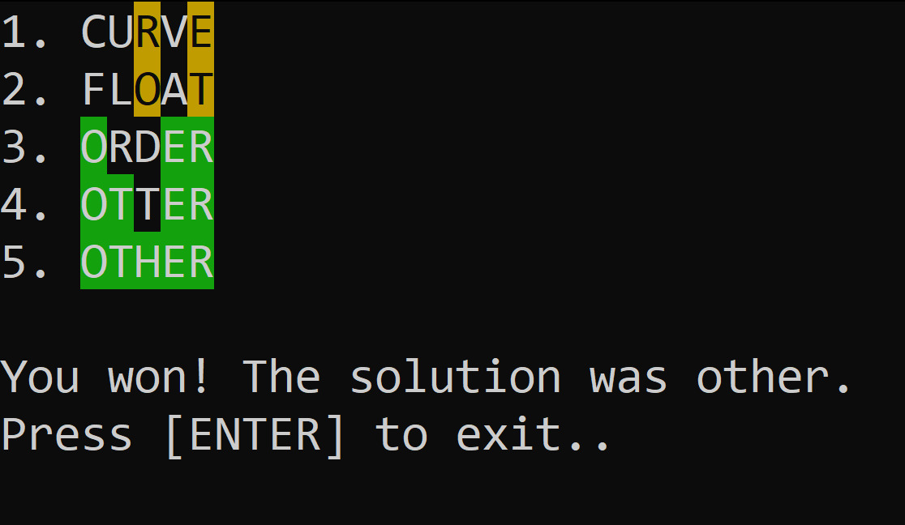

# Wordee


A CLI clone of the game [Wordle]([Wordle - The New York Times](https://www.nytimes.com/games/wordle/index.html)) written in Python.


**How to install:**

    1. Clone the repository

    2. Install the required modules from `requirements.txt`

    3. Place a [wordlist](https://github.com/dwyl/english-words/) inside the folder as `words.txt`

    4. Run `words.py`


**Arguments**:

All arguments are optional.

```bash
usage: wordee.py [-h] [-g GUESSES] [-l LENGHT] [-f FILE] [-s SOLUTION]

options:
  -h, --help            show this help message and exit
  -g GUESSES, --guesses GUESSES
                        Amount of allowed guesses
  -l LENGHT, --lenght LENGHT
                        Word lenght
  -f FILE, --file FILE  Wordlist file
  -s SOLUTION, --solution SOLUTION
                        Force a solution
```


**Screenshots:**




